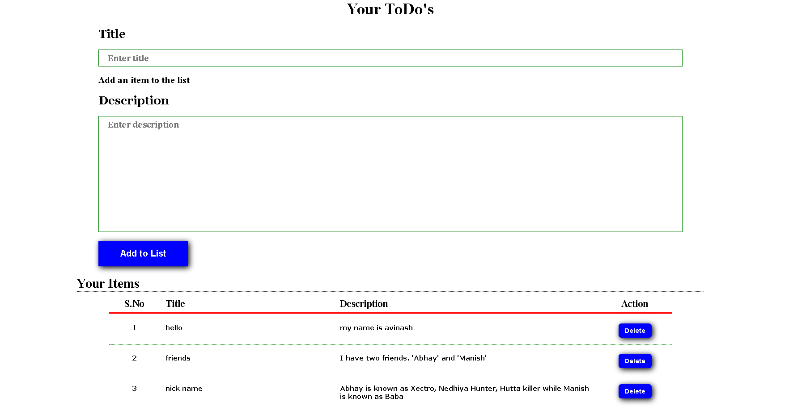

# ToDo List

This is a simple TodoList website created using only HTML, CSS and JAVASCRIPT. It has responsive design that adapts to different screen sizes. It uses browser's localstorage to save todos.



## Installation

To get started with this website, follow these steps:

1. Clone the repository:
    ```bash
    git clone https://github.com/avinashsinghwk/TodoList_HTML_CSS_JS.git
    ```
2. Navigate to the project directory:
    ```bash
    cd TodoList_HTML_CSS_JS
    ```

## Usage

Open the `index.html` file in your web browser to see the website.

